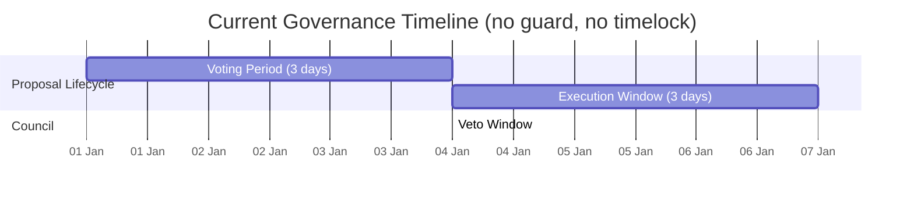
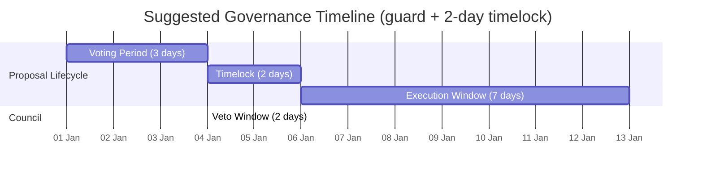

# Governance Parameters

Current on-chain parameters for Shutter DAO governance as of block `24,493,552` (Ethereum mainnet), and suggested changes for the security council guard installation.

## Current Parameters

### Azorius Module (`0xAA6BfA174d2f803b517026E93DBBEc1eBa26258e`)

| Parameter | Current Value | Suggested Value | Setter | Description |
| --- | --- | --- | --- | --- |
| `timelockPeriod` | `0` (no delay) | **`14,400` blocks (~2 days)** | `updateTimelockPeriod(uint32)` | Blocks between proposal passing and becoming executable |
| `executionPeriod` | `21,600` blocks (~3 days) | **`50,400` blocks (~7 days)** | `updateExecutionPeriod(uint32)` | Window in which a passed proposal can be executed |
| `guard` | `address(0)` (none) | **SecurityCouncilAzorius** | `setGuard(address)` | Transaction guard checked before each execution |
| `owner` | Shutter Safe | -- | -- | Only the Safe (via governance) can change these |

### LinearERC20Voting Strategy (`0x4b29d8B250B8b442ECfCd3a4e3D91933d2db720F`)

| Parameter | Current Value | Suggested Value | Setter | Description |
| --- | --- | --- | --- | --- |
| `votingPeriod` | `21,600` blocks (~3 days) | no change | `updateVotingPeriod(uint32)` | Duration of the voting window |
| `requiredProposerWeight` | `1e18` = **1 SHU** | **`100_000e18` (100K SHU)** | `updateRequiredProposerWeight(uint256)` | Minimum voting power (delegated) to submit a proposal |
| `quorumNumerator` | `30,000` / `1,000,000` = **3%** | no change | `updateQuorumNumerator(uint256)` | Minimum % of total supply that must vote FOR |
| `basisNumerator` | `500,000` / `1,000,000` = **50%** | no change | `updateBasisNumerator(uint256)` | Minimum % of votes cast that must be FOR to pass |
| `governanceToken` | SHU (`0xe485...Fd7`) | -- | immutable | 1B total supply, 18 decimals |
| `owner` | Shutter Safe | -- | -- | Only the Safe (via governance) can change these |

### Denominators (constants)

| Constant | Value |
| --- | --- |
| `QUORUM_DENOMINATOR` | `1,000,000` |
| `BASIS_DENOMINATOR` | `1,000,000` |

## Governance Timeline: Before and After

### Before (current)

**Total: 3 days submit-to-executable, 6 days submit-to-expiry.**

A passed proposal can be executed the instant voting ends. The council has **zero time** to review or veto. Anyone with 1 SHU can flood the system with proposals.

### After (suggested)

**Total: 5 days submit-to-executable, 12 days submit-to-expiry.**

The 2-day timelock gives the council a window to review passed proposals and veto if needed. The 7-day execution window gives legitimate proposers ample time to trigger execution without risk of expiry. The 100K SHU proposer threshold eliminates spam while still being accessible (0.01% of supply).

## Security Analysis of Suggested Changes

### timelockPeriod: `0` -> `14,400` blocks (~2 days)

**Critical.** Without a timelock, the guard is useless — there is no window for the council to veto.

Why 2 days:

- **Sufficient for review.** The council gets 2 full days to review a passed proposal before it becomes executable.
- **Multisig coordination.** If the council is a Safe multisig, signers need time to come online, review the proposal, discuss, and collect enough signatures to veto. 2 days is a practical minimum for this.
- **Precedent.** Compound, Optimism, and other major DAOs use 2-7 day timelocks. 2 days is within the standard range.
- **Faster governance.** A shorter timelock means legitimate proposals execute sooner, reducing the total governance lifecycle.

Attack scenario without timelock:

1. Attacker acquires 3% of SHU (30M tokens) via flash loan or market accumulation.
2. Submits a malicious proposal and votes it through in 3 days.
3. Executes immediately after voting ends. Council cannot react.

With 2-day timelock: the council has 2 full days between the vote passing and the proposal becoming executable. This is enough to detect, review, and veto.

### executionPeriod: `21,600` -> `50,400` blocks (~3 days -> ~7 days)

**Important.** With the new timelock adding 2 days before execution, the total lifecycle grows from 6 days to 12 days. The execution window needs to be forgiving enough so that legitimate proposals don't expire because the executor missed a tight window.

Why 7 days:

- **Weekends and holidays.** A 3-day execution window that starts on a Thursday evening expires on Sunday. Proposers and multisig executors shouldn't lose their passed proposal because of a weekend.
- **Operational safety.** If the executor has operational issues (key rotation, hardware failure, travel), 7 days is a reasonable buffer. A proposal that went through 3 days of voting + 2 days of timelock should not die because execution was delayed by 72 hours.
- **No security downside.** A longer execution window does not weaken security. The council already vetoed or allowed the proposal during the timelock. The execution window is just an operational convenience.

### requiredProposerWeight: `1 SHU` -> `100,000 SHU` (100K)

**Important.** The current threshold of 1 SHU (0.0000001% of supply) is dangerously low. This creates two attack vectors:

**1. Council attention exhaustion.** An attacker can spam hundreds of proposals for dust. The council must review every passed proposal during the timelock window. If the council is overwhelmed with junk, they may miss the one malicious proposal hidden in the noise.

**2. Governance DoS.** Mass proposal submission pollutes the governance UI and proposal index. Voters cannot distinguish real proposals from spam, eroding participation and trust.

Why 100K SHU (0.01% of supply):

- **High enough to prevent spam.** 100K SHU has meaningful market value, making proposal spam economically irrational.
- **Low enough to remain accessible.** 0.01% of supply is still achievable by any serious community member or delegate. For context, 30M SHU (3%) is needed to pass a proposal — 100K is 300x less than the quorum.
- **Delegation-based.** The threshold is based on delegated voting power, not token balance. A proposer with zero balance but 100K SHU delegated to them can still propose.

### votingPeriod, quorum, basis: no change

These parameters are independent of the guard's effectiveness. The guard operates in the timelock window, not during voting. The current values (3-day vote, 3% quorum, 50% basis) are standard for token-weighted governance.

## Proposal Transactions

The changes are split into two separate proposals so each can be voted on independently.

### Proposal A: Guard Installation

1. `Azorius.updateTimelockPeriod(14400)` -- introduce a 2-day timelock.
2. `Azorius.setGuard(guardAddress)` -- install the security council guard.

Order matters: set the timelock first, then install the guard. This ensures the guard is never active without a proper timelock window. Both transactions execute atomically.

### Proposal B: Governance Parameters Hardening

1. `Azorius.updateExecutionPeriod(50400)` -- extend execution window to 7 days.
2. `LinearERC20Voting.updateRequiredProposerWeight(100000000000000000000000)` -- raise proposer threshold to 100K SHU.

These parameter changes are independent of the guard and can be submitted as a follow-up proposal.

## Notes

- **timelockPeriod is in blocks**, not seconds. Azorius compares it against `block.number`.
- **executionPeriod is in blocks**, not seconds. It uses `block.number` comparison.
- The timelock starts counting after the voting period ends and the proposal is marked as passed.
- The council authority is `owner()` via OpenZeppelin `Ownable`. Council rotation is done via `transferOwnership(newCouncil)` — no guard redeployment needed. See `docs/OPERATIONS.md` for the rotation procedure.
- Changing the timelock later requires another governance proposal calling `updateTimelockPeriod`. The council cannot change it unilaterally.
- The guard and timelock must be installed atomically in the same proposal. If only the guard is installed without a timelock, the council has no reaction window and the guard is ineffective.
